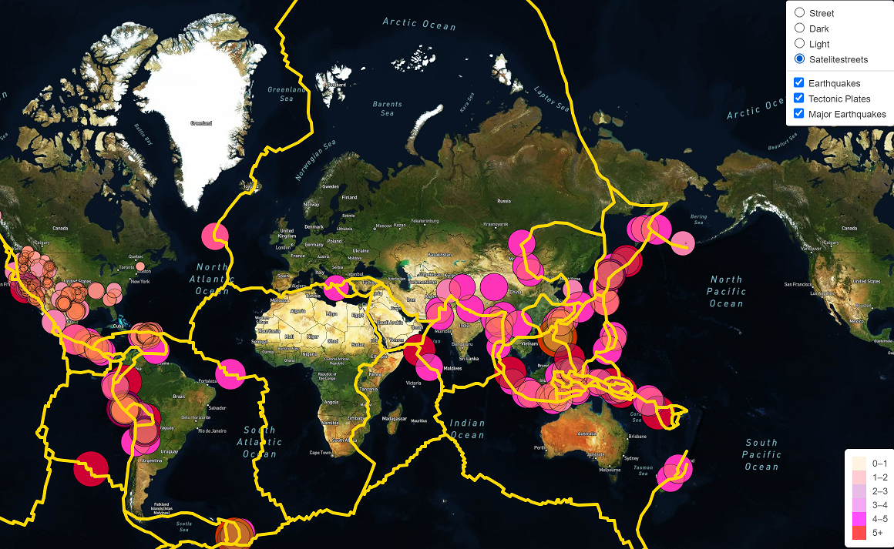
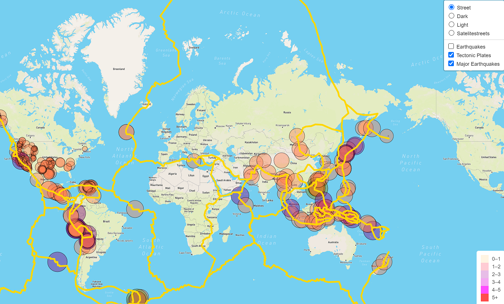
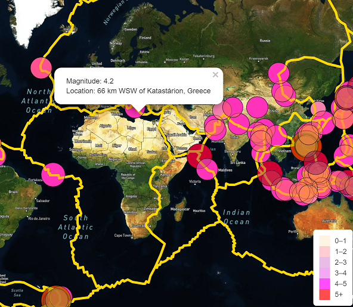

# Mapping_Earthquakes

Utilize collected data via GeoJSON and an API call to create an interactive earthquake map!

## Website

[Quake!](https://smgs2022.github.io/Mapping_Earthquakes/)

## Overview

Practice using Leaflet on numerous JSON files. In doing so, a script is created that extracts earthquake data. To make the website more personable, colors were chosen to illustrate a coded map identifying earthquakes, as well as a legend in the bottom right corner. For user activity, a dropdown menu is located in the upper right corner displaying, "street" and "satelight" views as well as an option to toggle between "light" and "dark visuals. Lastly, within the drop down menu, "earthquakes", "major earthquakes", and "tectonic plates". The user can manipulate all of these toggles to achieve their desired information.

## Results

As seen below, the map is on "satellite" view, and uses the "earthquakes", "tectonic plates", and "major earthquake" selections.

- Note: 
    The most earthquakes/ major earthquakes occur along the tectonic plates in both images
    

The image above is in "street" view with selections of only "major earthquakes" and "tectonic plates"

The image below shows a pop-up example displaying the magnitude of the earthquake and the location

## Summary

HTML shows a clear map of earthquakes, user-friendly toggles, and informative pop-ups.
